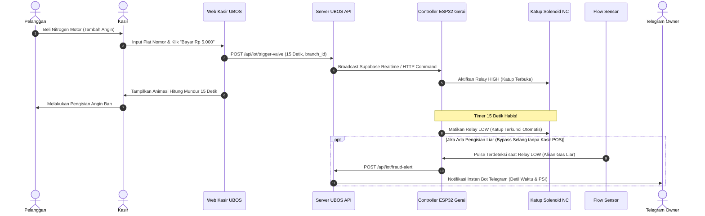

# PANDUAN LENGKAP INTEGRASI & SINKRONISASI PERANGKAT KERAS IOT (ESP32)
## UBOS Anti-Loss Interlocking Nitrogen & Multi-Branch Retail POS System

Dokumen ini adalah panduan teknis implementasi hardware untuk menghubungkan sistem web UBOS ke modul pengendali katup nitrogen di masing-masing cabang gerai fisik.

---

## 1. Arsitektur Perangkat Keras (Hardware Bill of Materials)

Setiap gerai cabang dipasangi satu unit pengendali (*Controller Box*) yang terdiri dari:

| No | Komponen Hardware | Spesifikasi Rekomendasi | Fungsi Utama |
| :--- | :--- | :--- | :--- |
| 1 | **Mikrokontroler** | ESP32 NodeMCU (30/38 Pin, Wi-Fi 2.4GHz) | Pemroses logika, penghitung timer, & komunikasi ke server |
| 2 | **Relay Module** | Relay 1-Channel 5V/12V Optocoupler Isolated | Saklar daya pembuka/penutup katup solenoid gas nitrogen |
| 3 | **Solenoid Valve** | Normally Closed (NC) 12V DC, Drat 1/2" High Pressure | Mengunci aliran selang nitrogen secara fisik saat POS siaga |
| 4 | **Flow Meter Sensor** | Hall Effect Sensor YF-S201 (atau Pressure Switch) | Mendeteksi detak aliran gas. Jika ada aliran tanpa POS $\rightarrow$ Fraud |
| 5 | **Power Supply** | Adaptor 12V DC 2A + Step-Down LM2596 (12V ke 5V) | Catu daya stabil untuk ESP32 dan Solenoid |
| 6 | **Buzzer Alarm** | Active Buzzer 5V DC | Peringatan suara di tempat saat terjadi kebocoran gas liar |

---

## 2. Skema Pengkabelan Pinout (Wiring Schematic)

```text
       [ Adaptor 12V DC ]
        │             │
        ├─────────────┼──────────────────(+) Solenoid Valve NC 12V
        │             │
        │      [Step-Down 5V]
        │       │         │
        │      (5V)     (GND)
        │       │         │
 ┌──────┴───────┴─────────┴────────────────────────────────────────┐
 │                      MODUL ESP32                                │
 │                                                                 │
 │   VIN ───────── 5V Step-Down                                    │
 │   GND ───────── GND Common                                      │
 │                                                                 │
 │   GPIO 26 ───── IN (Modul Relay 12V) ─── COM: 12V, NO: (-)Valve │
 │   GPIO 27 ───── Yellow/Signal (Flow Meter Sensor YF-S201)       │
 │   GPIO 25 ───── (+) Buzzer Alarm                                │
 │   GPIO 2  ───── Onboard Status LED (Blinking saat WiFi aktif)   │
 └─────────────────────────────────────────────────────────────────┘
```

---

## 3. Alur Logika Sinkronisasi (Interlocking Workflow)



---

## 4. Endpoint Komunikasi IoT di UBOS

### A. Endpoint Trigger Pembukaan Katup Solenoid
* **URL:** `POST https://domain-anda.com/api/iot/trigger-valve`
* **Request Header:** `Content-Type: application/json`
* **Request Body:**
```json
{
  "branch_id": "branch-utama",
  "timer_seconds": 35,
  "transaction_id": "TX-1741234567-890"
}
```
* **Respons:**
```json
{
  "success": true,
  "message": "Katup Solenoid Cabang branch-utama Berhasil Diaktifkan selama 35 detik",
  "branch_id": "branch-utama",
  "timer_seconds": 35
}
```

### B. Endpoint Peringatan Kecurangan / Anomali Aliran Gas Liar
* **URL:** `POST https://domain-anda.com/api/iot/fraud-alert`
* **Request Header:** `Content-Type: application/json`
* **Request Body:**
```json
{
  "branch_id": "branch-utama",
  "device_id": "ESP32-UTAMA-01",
  "alert_type": "UNAUTHORIZED_FLOW",
  "message": "Flow sensor mendeteksi aliran gas nitrogen 24 PSI selama 10 detik tanpa transaksi kasir!"
}
```

### C. Endpoint Detak Jantung Perangkat (Heartbeat Status)
* **URL:** `GET https://domain-anda.com/api/iot/device-status`
* **Respons:**
```json
[
  {
    "branchId": "branch-utama",
    "branchName": "Cabang Utama",
    "status": "ONLINE",
    "solenoidValveStatus": "STANDBY",
    "lastHeartbeat": "2026-10-07T10:30:00Z"
  }
]
```

---

## 5. Firmware C++ Arduino / ESP32 Siap Flash

Salin dan upload kode berikut ke mikrokontroler ESP32 menggunakan **Arduino IDE**:

```cpp
#include <WiFi.h>
#include <HTTPClient.h>
#include <ArduinoJson.h>

// ---------------- PENGATURAN KONEKSI & CABANG ----------------
const char* ssid = "NAMA_WIFI_OUTLET";
const char* password = "PASSWORD_WIFI";
const char* serverUrl = "https://ubos-app.vercel.app"; // Ganti dengan domain UBOS Anda
const char* branchId = "branch-utama";                 // ID Cabang yang terdaftar di UBOS
const char* deviceId = "ESP32-UTAMA-01";

// ---------------- PIN DEFINITIONS ----------------------------
const int RELAY_PIN   = 26; // Output ke Modul Relay Katup Solenoid
const int FLOW_PIN    = 27; // Input Pulsa dari Flow Sensor YF-S201
const int BUZZER_PIN  = 25; // Output ke Buzzer Alarm Anomali
const int LED_STATUS  = 2;  // Onboard LED Indikator WiFi

// ---------------- VARIABEL STATE & TIMER ---------------------
volatile unsigned long flowPulseCount = 0;
bool isValveOpen = false;
unsigned long valveCloseTime = 0;
unsigned long lastHeartbeatTime = 0;

void IRAM_ATTR pulseCounter() {
  flowPulseCount++;
}

void setup() {
  Serial.begin(115200);
  
  pinMode(RELAY_PIN, OUTPUT);
  pinMode(BUZZER_PIN, OUTPUT);
  pinMode(LED_STATUS, OUTPUT);
  pinMode(FLOW_PIN, INPUT_PULLUP);

  // Default katup terkunci rapat (Relay OFF)
  digitalWrite(RELAY_PIN, LOW);
  digitalWrite(BUZZER_PIN, LOW);

  attachInterrupt(digitalPinToInterrupt(FLOW_PIN), pulseCounter, RISING);

  connectToWiFi();
}

void connectToWiFi() {
  Serial.print("Menghubungkan ke Wi-Fi...");
  WiFi.begin(ssid, password);
  while (WiFi.status() != WL_CONNECTED) {
    delay(500);
    Serial.print(".");
    digitalWrite(LED_STATUS, !digitalRead(LED_STATUS));
  }
  Serial.println("\nWiFi Terhubung! IP: " + WiFi.localIP().toString());
  digitalWrite(LED_STATUS, HIGH);
}

void loop() {
  if (WiFi.status() != WL_CONNECTED) {
    connectToWiFi();
  }

  unsigned long currentMillis = millis();

  // 1. CEK TIMER KATUP SOLENOID (AUTO-LOCK)
  if (isValveOpen && currentMillis >= valveCloseTime) {
    digitalWrite(RELAY_PIN, LOW); // Tutup katup solenoid fisik
    isValveOpen = false;
    Serial.println(">> Waktu habis! Katup Solenoid terkunci kembali (LOCKED).");
  }

  // 2. DETEKSI KECURANGAN / ANOMALI (FLOW LIAR TANPA TRANSAKSI)
  // Jika katup berstatus tertutup (Relay LOW), tetapi flow meter mendeteksi aliran gas
  if (!isValveOpen && flowPulseCount > 10) {
    Serial.println(">> PERINGATAN: Aliran gas terdeteksi tanpa transaksi POS!");
    digitalWrite(BUZZER_PIN, HIGH);
    sendFraudAlert("Terdeteksi aliran gas keluar padahal katup solenoid sedang terkunci!");
    delay(1000);
    digitalWrite(BUZZER_PIN, LOW);
    flowPulseCount = 0;
  }

  // Reset pulse counter jika normal
  if (isValveOpen && flowPulseCount > 0) {
    flowPulseCount = 0; // Aliran sah karena katup sedang terbuka resmi
  }

  delay(50);
}

// FUNGSI AKTIVASI KATUP SOLENOID OLEH KASIR
void activateValve(int durationSeconds) {
  Serial.printf(">> Membuka Katup Solenoid selama %d detik...\n", durationSeconds);
  digitalWrite(RELAY_PIN, HIGH);
  isValveOpen = true;
  valveCloseTime = millis() + (durationSeconds * 1000);
  flowPulseCount = 0;
}

// KIRIM LAPORAN FRAUD KE SERVER WEB & TELEGRAM
void sendFraudAlert(String description) {
  if (WiFi.status() != WL_CONNECTED) return;

  HTTPClient http;
  String url = String(serverUrl) + "/api/iot/fraud-alert";
  http.begin(url);
  http.addHeader("Content-Type", "application/json");

  StaticJsonDocument<256> doc;
  doc["branch_id"] = branchId;
  doc["device_id"] = deviceId;
  doc["alert_type"] = "UNAUTHORIZED_FLOW";
  doc["message"] = description;

  String requestBody;
  serializeJson(doc, requestBody);

  int httpCode = http.POST(requestBody);
  Serial.printf("Status Lapor Fraud: %d\n", httpCode);
  http.end();
}
```

---

## 6. Uji Coba Lapangan & Kalibrasi
1. Pasang perangkat di box panel tertutup (disegel agar tidak dimodifikasi mekanik outlet).
2. Lakukan transaksi di Kasir POS UBOS $\rightarrow$ Pastikan lampu relay menyala dan gas mengalir selama hitungan detik paket.
3. Coba tekan katup manual atau potong selang bypass saat kasir tidak aktif $\rightarrow$ Pastikan notifikasi Telegram darurat masuk ke HP Owner dalam waktu kurang dari 3 detik.
